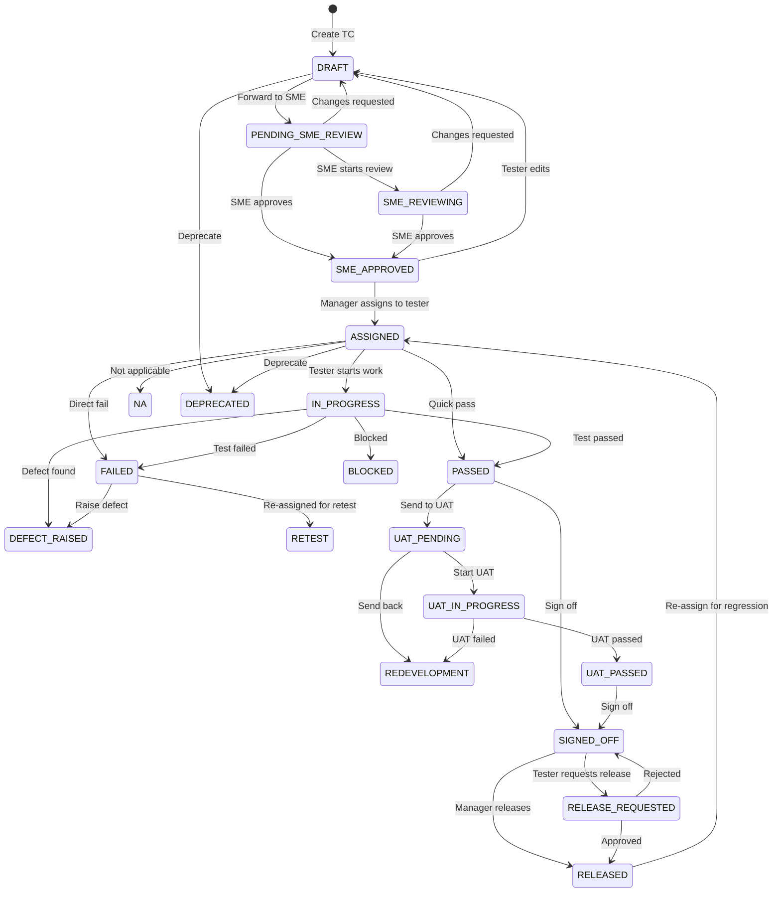
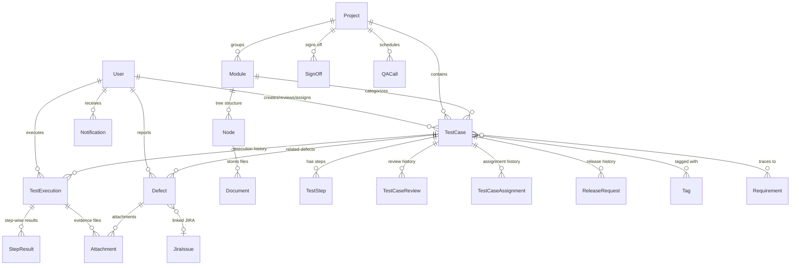

# 🧪 SmartQA - Test Management System Architecture

## Complete End-to-End Flow Diagram

```mermaid
%%{init: {'theme': 'dark', 'themeVariables': { 'primaryColor': '#1a1a2e', 'primaryTextColor': '#e2e8f0', 'primaryBorderColor': '#4a5568', 'lineColor': '#6b7280', 'secondaryColor': '#16213e', 'tertiaryColor': '#0f3460'}}}%%

graph TB
    %% ============================================================
    %% CLIENT LAYER - React Frontend
    %% ============================================================
    subgraph Client["🌐 Frontend (React + Vite)"]
        direction TB
        Router["React Router<br/>(BrowserRouter)"]
        
        subgraph Pages["📄 Application Pages"]
            Login["🔑 LoginPage"]
            Dashboard["📊 Dashboard"]
            TestCases["🧪 TestCasesPage"]
            MyCases["📋 MyTestCasesPage"]
            Execution["▶️ ExecutionPage"]
            Workflow["⚙️ WorkflowPage"]
            UATFlow["🔄 UATWorkflowPage"]
            AssignModule["📌 AssignByModulePage"]
            DailyTrack["📈 DailyTrackingPage"]
            Productivity["📊 ProductivityPage"]
            Projects["📁 ProjectsPage"]
            Users["👥 UsersPage"]
            Workload["⚡ WorkloadDashboardPage"]
            Defects["🐛 DefectsPage"]
            Repository["📦 RepositoryPage"]
            Requirements["📋 RequirementsPage"]
            ReleaseInbox["📬 ReleaseInboxPage"]
            Calls["📞 CallsPage"]
        end
        
        subgraph AuthHooks["🔐 Auth Layer"]
            AuthProvider["AuthProvider<br/>(useAuth hook)"]
            ProtectedRoute["ProtectedRoute<br/>(role-based guard)"]
        end
        
        subgraph Components["🧩 Shared Components"]
            Layout["Layout.jsx"]
            GlobalSearch["🔍 GlobalSearchBar"]
            NotificationBell["🔔 NotificationBell"]
            AttachmentUpload["📎 AttachmentUploader"]
            VersionHistory["📜 VersionHistoryPanel"]
        end
        
        subgraph APILayer["📡 API Layer (axios)"]
            AuthAPI["authApi"]
            ProjectAPI["projectApi"]
            TestCaseAPI["testCaseApi"]
            DefectAPI["defectApi"]
            ExecutionAPI["executionApi"]
            UserAPI["userApi"]
            ReportAPI["reportApi"]
            ProductivityAPI["productivityApi"]
            WorkflowAPI["workflowApi"]
            ReleaseAPI["releaseApi"]
            RepositoryAPI["repositoryApi"]
            CallAPI["callApi"]
            JiraAPI["jiraApi"]
            SearchAPI["searchApi"]
            TagAPI["tagApi"]
            RequirementAPI["requirementApi"]
            AttachmentAPI["attachmentApi"]
            NotificationAPI["notificationApi"]
            VersionAPI["versionApi"]
            WorkloadAPI["workloadApi"]
        end
    end

    %% ============================================================
    %% BACKEND LAYER - Spring Boot
    %% ============================================================
    subgraph Backend["☕ Backend (Spring Boot 3.x)"]
        direction TB
        
        subgraph Security["🛡️ Security Layer"]
            SecurityConfig["SecurityConfig<br/>(JWT Filter)"]
            JWT["JWT Token<br/>Authentication"]
        end
        
        subgraph Controllers["🎮 REST Controllers"]
            AuthCtrl["AuthController<br/>/api/v1/auth"]
            UserCtrl["UserController<br/>/api/v1/users"]
            ProjectCtrl["ProjectController<br/>/api/v1/projects"]
            TestCaseCtrl["TestCaseController<br/>/api/v1/testcases"]
            WorkflowCtrl["WorkflowController<br/>/api/v1/testcases"]
            ExecutionCtrl["TestExecutionController<br/>/api/v1/executions"]
            DefectCtrl["DefectController<br/>/api/v1/defects"]
            DashboardCtrl["ManagerDashboardController<br/>/api/v1/reports"]
            ProductCtrl["TesterProductivityController<br/>/api/v1/productivity"]
            ModuleCtrl["RepositoryModuleController<br/>/api/v1/repository-modules"]
            RepoCtrl["RepositoryController<br/>/api/v1/repository"]
            ReleaseCtrl["ReleaseController<br/>/api/v1/releases"]
            NotifCtrl["NotificationController<br/>/api/v1/notifications"]
            SearchCtrl["SearchController<br/>/api/v1/search"]
            TagCtrl["TagController<br/>/api/v1/tags"]
            ReqCtrl["RequirementController<br/>/api/v1/requirements"]
            CallsCtrl["QACallController<br/>/api/v1/calls"]
            JiraCtrl["JiraController<br/>/api/v1/jira"]
            AttachCtrl["AttachmentController<br/>/api/v1/attachments"]
            VersionCtrl["TestCaseVersionController<br/>/api/v1/testcases/{id}/versions"]
            WorkloadCtrl["WorkloadController<br/>/api/v1/productivity"]
            HealthCtrl["HealthController<br/>/api/v1/health"]
        end
        
        subgraph Services["⚙️ Service Layer"]
            AuthSvc["AuthService"]
            UserSvc["UserService"]
            ProjectSvc["ProjectService"]
            TestCaseSvc["TestCaseService"]
            WorkflowSvc["TestCaseWorkflowService"]
            ExecutionSvc["TestExecutionService"]
            DefectSvc["DefectService"]
            DashboardSvc["ManagerDashboardService"]
            SMEDashSvc["SMEDashboardService"]
            ProductSvc["TesterProductivityService"]
            ModuleSvc["RepositoryModuleService"]
            RepoSvc["RepositoryService"]
            ReleaseSvc["ReleaseService"]
            NotifSvc["NotificationService"]
            SearchSvc["SearchService"]
            TagSvc["TagService"]
            ReqSvc["RequirementService"]
            CallSvc["QACallService"]
            JiraSvc["JiraService"]
            AttachSvc["AttachmentService"]
            VersionSvc["TestCaseVersionService"]
            ImportSvc["TestCaseImportService"]
            WorkloadSvc["WorkloadService"]
        end
        
        subgraph Repositories["🗃️ Repository Layer (Spring Data JPA)"]
            UserRepo["UserRepository"]
            ProjectRepo["ProjectRepository"]
            TestCaseRepo["TestCaseRepository"]
            ExecutionRepo["TestExecutionRepository"]
            DefectRepo["DefectRepository"]
            ReviewRepo["TestCaseReviewRepository"]
            AssignmentRepo["TestCaseAssignmentRepository"]
            SignOffRepo["SignOffRepository"]
            ModuleRepo["ModuleRepository"]
            DocumentRepo["DocumentRepository"]
            NodeRepo["NodeRepository"]
            ReleaseRepo["ReleaseRequestRepository"]
            NotifRepo["NotificationRepository"]
            TagRepo["TagRepository"]
            ReqRepo["RequirementRepository"]
            CallRepo["QACallRepository"]
            AttachRepo["AttachmentRepository"]
            VersionRepo["TestStepVersionRepository"]
            StepRepo["TestStepRepository"]
            ProductRepo["DailyProductivityRepository"]
        end
        
        subgraph Entities["📦 JPA Entities"]
            User["User"]
            Project["Project"]
            TestCase["TestCase"]
            TestStep["TestStep"]
            Execution["TestExecution"]
            StepResult["StepResult"]
            Defect["Defect"]
            Tag["Tag"]
            Requirement["Requirement"]
            Module["Module"]
            Node["Node"]
            Document["Document"]
            Review["TestCaseReview"]
            Assignment["TestCaseAssignment"]
            SignOff["SignOff"]
            Release["ReleaseRequest"]
            Notification["Notification"]
            Call["QACall"]
            Attachment["Attachment"]
            Version["TestStepVersion"]
            Productivity["DailyProductivity"]
        end
        
        subgraph DTOs["📤 Request/Response DTOs"]
            AuthDTO["Auth DTOs"]
            ResponseDTO["Response DTOs"]
            ExecutionDTO["Execution DTOs"]
            WorkflowDTO["Workflow DTOs"]
            ModuleDTO["RepositoryModule DTOs"]
        end
        
        subgraph Enums["🔢 Enumerations"]
            UserRole["UserRole<br/>(ADMIN/MANAGER/SME/TESTER/VIEWER)"]
            TestStatus["TestStatus<br/>(20+ workflow states)"]
            ExecResult["ExecResult<br/>(PASSED/FAILED/BLOCKED/...)"]
            Priority["Priority<br/>(HIGH/MEDIUM/LOW)"]
            NotifType["NotificationType"]
        end
    end

    %% ============================================================
    %% DATA FLOW CONNECTIONS
    %% ============================================================
    
    %% Frontend Internal
    Router --> AuthProvider
    AuthProvider --> ProtectedRoute
    ProtectedRoute --> Pages
    
    Layout --> Dashboard
    Layout --> TestCases
    Layout --> MyCases
    Layout --> Execution
    Layout --> Workflow
    Layout --> UATFlow
    Layout --> AssignModule
    Layout --> DailyTrack
    Layout --> Productivity
    Layout --> Projects
    Layout --> Users
    Layout --> Workload
    Layout --> Defects
    Layout --> Repository
    Layout --> Requirements
    Layout --> ReleaseInbox
    Layout --> Calls
    Layout --> GlobalSearch
    Layout --> NotificationBell
    
    Pages --> APILayer
    
    %% Frontend to Backend
    AuthAPI --> AuthCtrl
    ProjectAPI --> ProjectCtrl
    TestCaseAPI --> TestCaseCtrl
    WorkflowAPI --> WorkflowCtrl
    ExecutionAPI --> ExecutionCtrl
    DefectAPI --> DefectCtrl
    UserAPI --> UserCtrl
    ReportAPI --> DashboardCtrl
    ProductivityAPI --> ProductCtrl
    ModuleCtrl --> RepoCtrl
    RepositoryAPI --> RepoCtrl
    ReleaseAPI --> ReleaseCtrl
    NotificationAPI --> NotifCtrl
    SearchAPI --> SearchCtrl
    TagAPI --> TagCtrl
    RequirementAPI --> ReqCtrl
    CallAPI --> CallsCtrl
    JiraAPI --> JiraCtrl
    AttachmentAPI --> AttachCtrl
    VersionAPI --> VersionCtrl
    WorkloadAPI --> WorkloadCtrl
    
    %% Backend Internal
    SecurityConfig --> JWT
    
    Controllers --> Services
    Services --> Repositories
    Repositories --> Entities
    
    %% Service Details
    AuthCtrl --> AuthSvc
    UserCtrl --> UserSvc
    ProjectCtrl --> ProjectSvc
    TestCaseCtrl --> TestCaseSvc
    WorkflowCtrl --> WorkflowSvc
    ExecutionCtrl --> ExecutionSvc
    DefectCtrl --> DefectSvc
    DashboardCtrl --> DashboardSvc
    DashboardCtrl --> SMEDashSvc
    ProductCtrl --> ProductSvc
    ModuleCtrl --> ModuleSvc
    RepoCtrl --> RepoSvc
    ReleaseCtrl --> ReleaseSvc
    NotifCtrl --> NotifSvc
    SearchCtrl --> SearchSvc
    TagCtrl --> TagSvc
    ReqCtrl --> ReqSvc
    CallsCtrl --> CallSvc
    JiraCtrl --> JiraSvc
    AttachCtrl --> AttachSvc
    VersionCtrl --> VersionSvc
    WorkflowCtrl --> ImportSvc
    WorkloadCtrl --> WorkloadSvc
    
    %% Entity Relationships
    TestCase --> Project
    TestCase --> Module
    TestCase --> User
    TestCase --> TestStep
    TestCase --> Tag
    TestCase --> Requirement
    TestCase --> Review
    TestCase --> Assignment
    TestCase --> Release
    Execution --> TestCase
    Execution --> StepResult
    Defect --> TestCase
    Attachment --> Execution
    Attachment --> Defect
    Module --> Project
    Node --> Module
    Document --> Node
    SignOff --> Project
    Productivity --> User
    
    Controllers --> DTOs
    DTOs --> Enums
    Services --> Enums
    Entities --> Enums
```



---

## 📋 Detailed Component Interaction Flow

### 1. 🔐 Authentication Flow
```
Browser → LoginPage → authApi.login() → AuthController (/auth/login)
    → AuthService.login() → UserRepository.findByEmail() → JWT Token Response
    → Store token in localStorage → Redirect to Dashboard
```

### 2. 🔄 Test Case Lifecycle (Core Workflow)
```
┌─────────────────────────────────────────────────────────────────────────┐
│                      TEST CASE LIFECYCLE                                │
│                                                                         │
│   DRAFT ──→ PENDING_SME_REVIEW ──→ SME_APPROVED ──→ ASSIGNED            │
│     ↑              │                    │               │               │
│     │              ▼                    │               ▼               │
│     │         SME_REVIEWING             │          IN_PROGRESS          │
│     │              │                    │               │               │
│     └── DRAFT ←───┘                    │               ├──→ PASSED     │
│         (Changes                       │               ├──→ FAILED     │
│          Requested)                    │               └──→ DEFECT      │
│                                        │                              │
│                                   ASSIGNED ──→ UAT_PENDING            │
│                                                         │             │
│                                                    UAT_IN_PROGRESS     │
│                                                      │        │        │
│                                                 UAT_PASSED  REDEVELOP  │
│                                                      │                 │
│                                                  SIGNED_OFF            │
│                                                      │                 │
│                                                  RELEASED              │
└─────────────────────────────────────────────────────────────────────────┘
```

### 3. 🗂️ Frontend Page → Backend Service Mapping

| Frontend Page | API Module | Backend Controller | Backend Service |
|--------------|------------|-------------------|-----------------|
| LoginPage | authApi | AuthController | AuthService |
| Dashboard | reportApi | ManagerDashboardController | ManagerDashboardService / SMEDashboardService |
| TestCasesPage | testCaseApi | TestCaseController | TestCaseService |
| MyTestCasesPage | testCaseApi | TestCaseController | TestCaseService |
| ExecutionPage | executionApi | TestExecutionController | TestExecutionService |
| WorkflowPage | workflowApi | WorkflowController | TestCaseWorkflowService |
| UATWorkflowPage | workflowApi | WorkflowController | TestCaseWorkflowService |
| AssignByModulePage | testCaseApi | WorkflowController | TestCaseWorkflowService |
| DailyTrackingPage | productivityApi | TesterProductivityController | TesterProductivityService |
| ProductivityPage | productivityApi | TesterProductivityController | TesterProductivityService |
| ProjectsPage | projectApi | ProjectController | ProjectService |
| UsersPage | userApi | UserController | UserService |
| WorkloadDashboardPage | workloadApi | WorkloadController | WorkloadService |
| DefectsPage | defectApi | DefectController | DefectService |
| RepositoryPage | repositoryApi | RepositoryController | RepositoryService |
| RequirementsPage | requirementApi | RequirementController | RequirementService |
| ReleaseInboxPage | releaseApi | ReleaseController | ReleaseService |
| CallsPage | callApi | QACallController | QACallService |

### 4. 🧪 Test Case Status Workflow State Machine



### 5. 📂 Database Schema Relationships



### 6. 🚀 Deployment Architecture

```mermaid
graph LR
    subgraph Frontend["Frontend (Vite + React)"]
        Browser["🌐 Browser"]
        Nginx["Nginx<br/>(Static Serving)"]
    end
    
    subgraph Backend["Backend (Spring Boot)"]
        App["Java 17<br/>Spring Boot 3.x"]
    end
    
    subgraph Storage["File Storage"]
        Uploads["📁 uploads/"]
    end
    
    subgraph External["External Integrations"]
        JIRA["🔗 JIRA Cloud"]
    end
    
    Browser --> Nginx
    Nginx --> |"/api/*" proxy| App
    App --> |"JDBC"| PostgreSQL[("🐘 PostgreSQL<br/>test_management_db")]
    App --> Uploads
    App --> JIRA
    
    style Frontend fill:#1a1a2e,stroke:#4a5568
    style Backend fill:#16213e,stroke:#4a5568
    style Storage fill:#0f3460,stroke:#4a5568
    style External fill:#1a1a2e,stroke:#4a5568
```



---

## 📊 API Endpoint Summary (115+ Endpoints)

| Category | Count | Key Endpoints |
|----------|-------|---------------|
| 🔐 Authentication | 3 | POST /login, /register, /change-password |
| 👥 Users | 9 | CRUD, activate/deactivate, role management |
| 📁 Projects | 6 | CRUD with nested sub-projects |
| 🧪 Test Cases | 5 | CRUD with filters (project, status, assignee) |
| ⚙️ Workflow | 18 | SME review, assignment, UAT, clone, sign-off |
| ▶️ Test Execution | 6 | Submit, update, history, summary dashboard |
| 🐛 Defects | 3 | CRUD with status transitions |
| 📎 Attachments | 7 | Upload/download (PDF conversion), delete |
| 📋 Requirements | 4 | CRUD with test case traceability |
| 📦 Central Repository | 6 | Document management with categories |
| 🗂️ Repository Modules | 15 | Hierarchical tree (modules → nodes → docs) |
| 📊 Reports | 3 | Manager dashboard, SME dashboard, module breakdown |
| 📈 Productivity | 6 | Team/individual metrics, daily tracking |
| 🔔 Notifications | 4 | List, unread count, mark read |
| 🔍 Search | 1 | Global search (test cases + defects) |
| 🏷️ Tags | 4 | CRUD with test case association |
| 📞 QA Calls | 10 | Schedule, complete with MoM, summary |
| 🔗 JIRA | 5 | Create issue, transition, webhook |
| ✅ Health | 2 | Health check, system info |

---

## 🔑 Default Credentials

| Role | Email | Password |
|------|-------|----------|
| **Admin** | admin@testmgmt.io | Admin@1234 |
| **Manager** | manager@testmgmt.io | Manager@1234 |
| **SME** | sme@testmgmt.io | Sme@1234 |
| **Tester** | tester@testmgmt.io | Tester@1234 |

---

## 🎯 Key Design Patterns

1. **JWT Authentication** - Stateless auth with token-based session
2. **Role-Based Access Control** - @PreAuthorize on all endpoints
3. **Spring Data JPA** - Repository pattern with lazy loading
4. **DTO Pattern** - Clear separation between entity and API response
5. **Caching** - @Cacheable/@CacheEvict for dashboard performance
6. **Service Layer** - All business logic in services
7. **Notification System** - Auto-notifications on key workflow events
8. **Audit Trail** - Review and assignment history tracking
